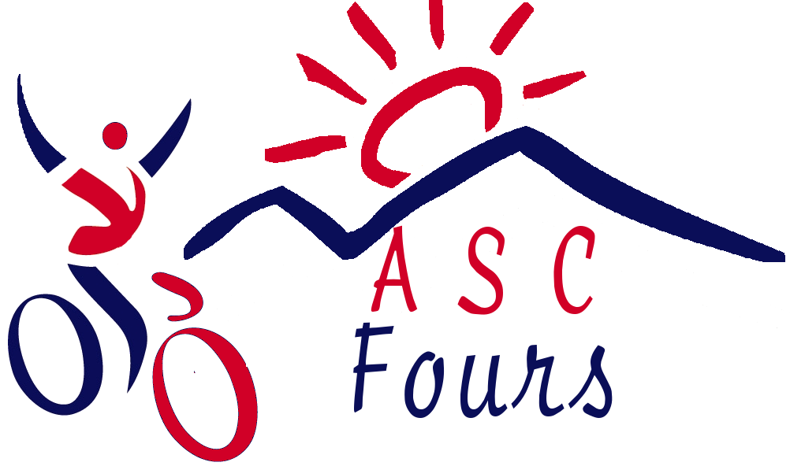
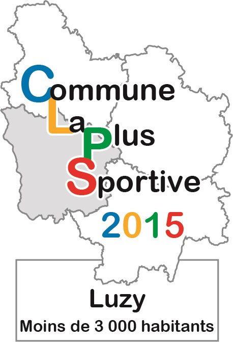

LA SUD MORVANDELLE
==================

La deuxième édition de la **SUD MORVANDELLE** aura lieu le *samedi 16 Juillet* 2016 à *LUZY*.
Les organisateurs repartent dans le même état d’esprit c'est-à-dire en mettant au centre de l'événement les valeurs de convivialité, de partage, découverte et respect de la nature. Ce sera aussi l’occasion de **découvrir** ou redécouvrir **le terroir local et ses acteurs**.

Des nouveautés seront proposées. Ainsi, une randonnée cyclotouriste parcourra l'ensemble des villages de la communauté de communes et abordera les premiers contreforts du MORVAN.

Un circuit pédestre longue distance pour randonneurs chevronnés proposera l'**ascension du MONT-BEUVRAY** (LUZY / MONT-BEUVRAY, aller–retour). Une **visite de LUZY** avec JEAN-PIERRE MORDIER, membre du groupe d’histoire locale, sera proposée. La visite débutera à la Mairie (salle des tapisseries) à 10h et sera suivie d’une promenade au centre ville pour comprendre l’évolution de la ville au cours des trois siècles derniers ; retour vers 10h30 à la GRANDE HALLE.

Ces trois nouvelles activités donneront le coup d’envoi de la journée **SPORT NATURE** dès le matin. Elles laisseront place l’après midi aux **randonnées pédestres** (3 distances au choix), **course à pieds**, **équestre** et **VTT à travers les paysages du SUD MORVAN**.

LA **GRANDE HALLE** sera le **centre névralgique** de la journée. Cet espace sera non seulement le lieu de départ, de retour et de restauration de toutes les activités mais également un lieu ou les exposants vous proposeront produits du terroir, objets d’arts, espace bien être, etc.

Un repas campagnard sera servi en soirée dans une ambiance festive.

  
